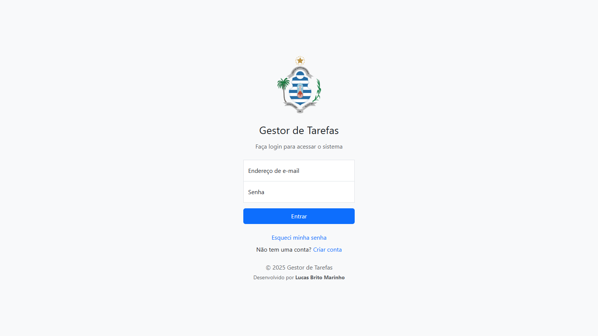
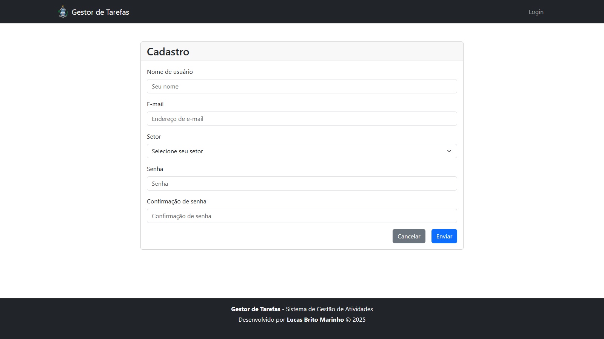
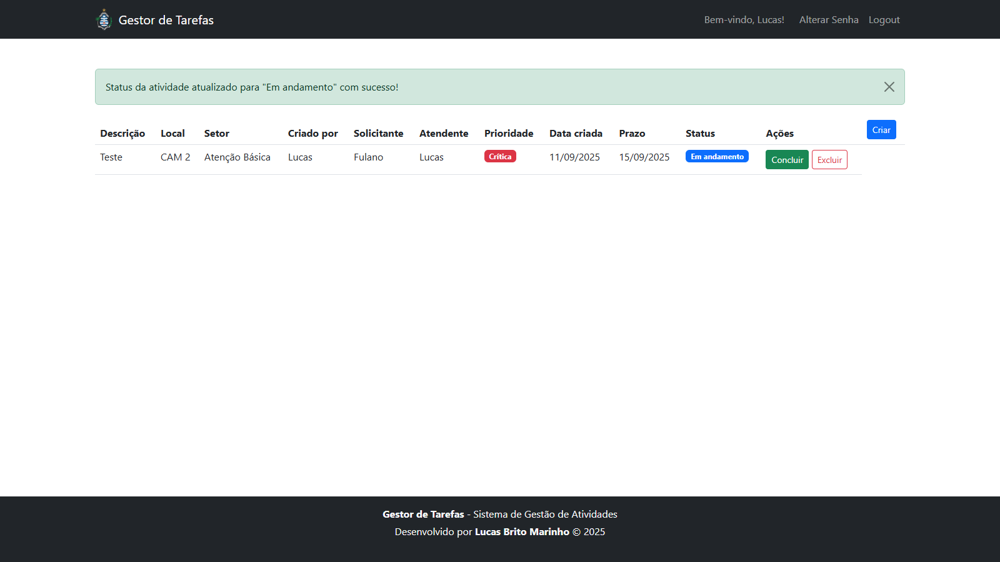
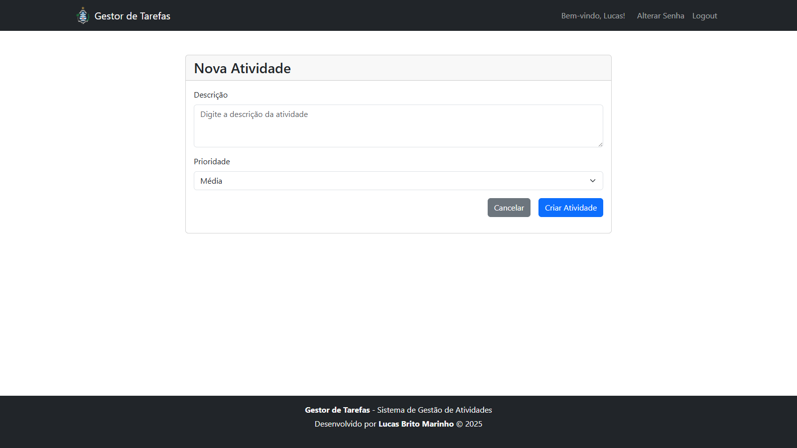
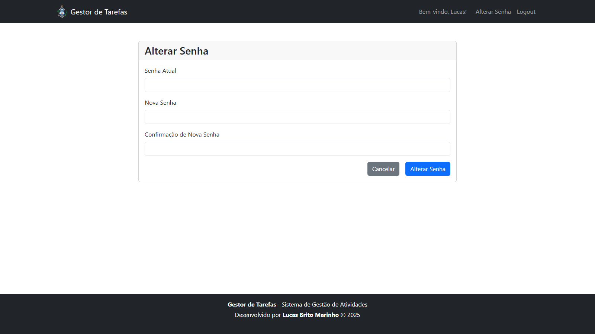
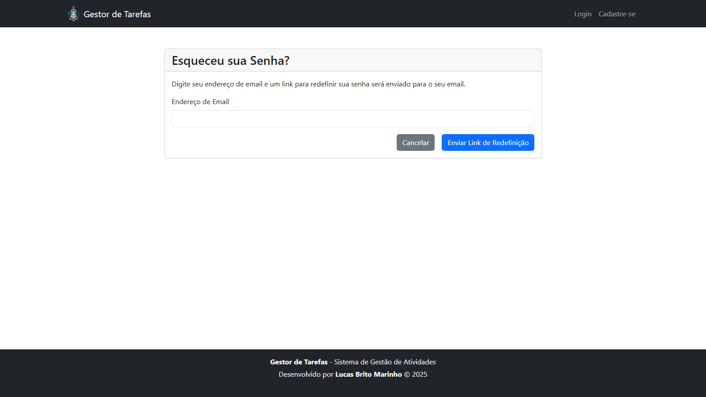

# Screenshots - Gestor de Tarefas

Este documento reúne capturas de tela das principais páginas e funcionalidades do sistema Gestor de Tarefas.

### README
👉 https://github.com/lucasbm92/miniature-octo-giggle/blob/main/README.md

## 1. Tela de Login

## 2. Tela de Cadastro

## 3. Página Inicial / Dashboard

## 4. Nova Tarefa

## 5. Alterar Senha

## 6. Esqueceu a Senha

---
